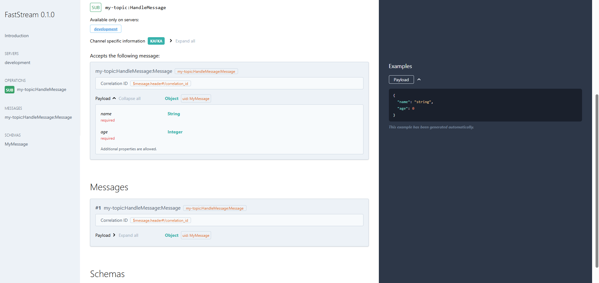

# kafka-playground

A simple, practical demo app using [FastStream](https://github.com/ag2ai/faststream) with Kafka and [Pydantic](https://docs.pydantic.dev/) to build event-driven apps — complete with auto-generated AsyncAPI documentation.

---

## What’s Inside

-   A Kafka producer and consumer using FastStream
-   Pydantic models for validating message schemas

---

## Installation

First run Kafka

```bash
docker compose up -d
```

Make sure you have [Poetry](https://python-poetry.org/) installed, then run:

```bash
poetry install
```

Run Faststream producers and consumers

```bash
poetry run python main.py
```

to serve the AsyncAPI docs

```bash
faststream docs serve main:app --port 8080
```


